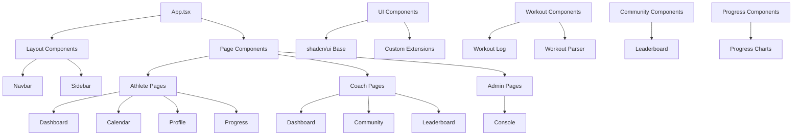
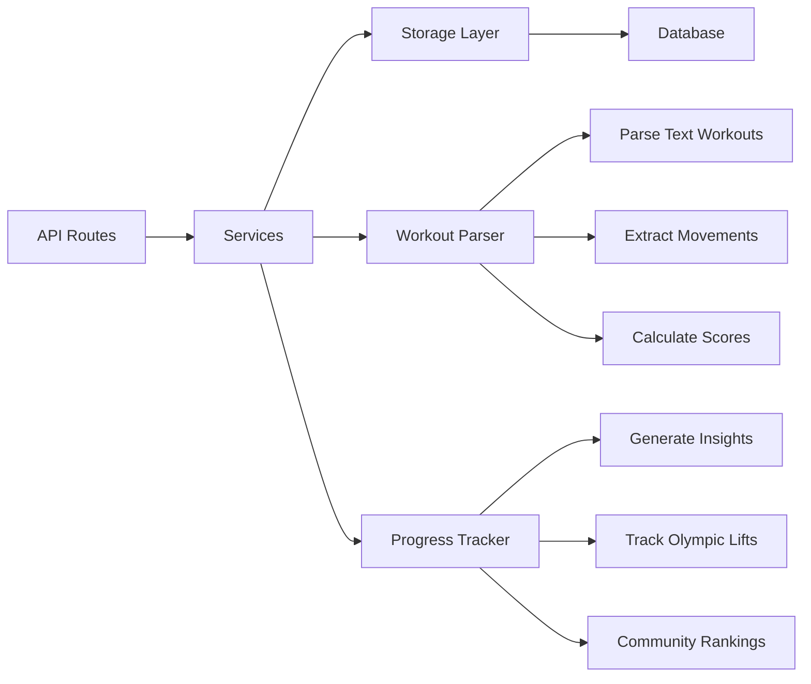
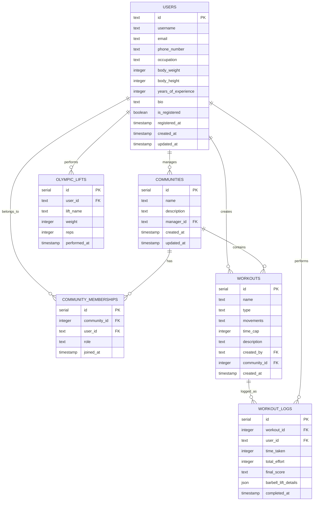
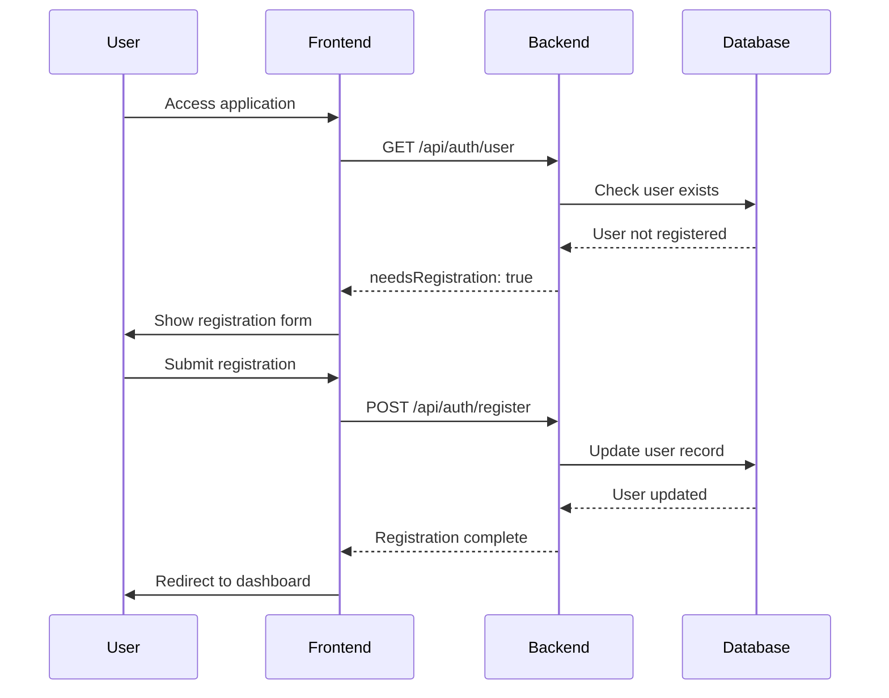
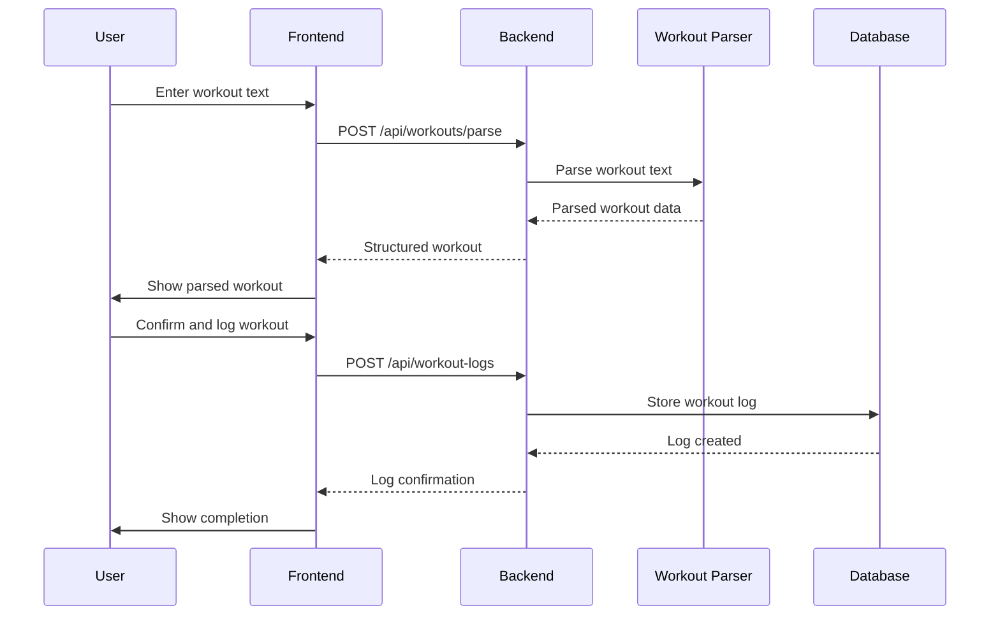
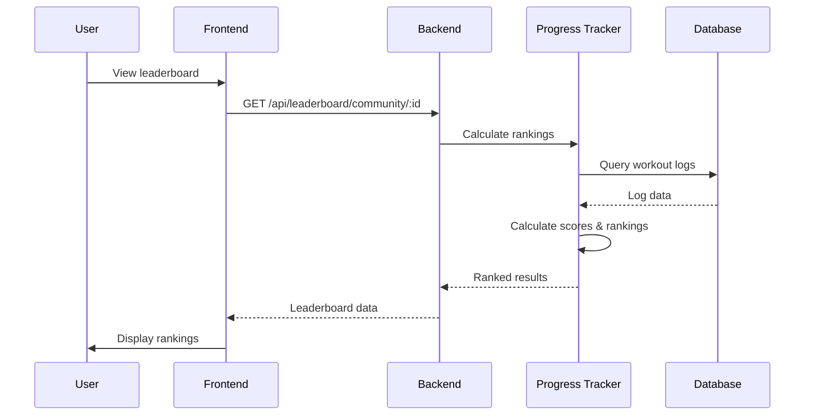

# AthletePro Component Architecture

## Overview
AthletePro is a full-stack fitness application built with React/TypeScript frontend and Node.js/Express backend, using PostgreSQL with Drizzle ORM for data persistence.

## System Architecture

```mermaid
graph TB
    subgraph "Frontend (React/TypeScript)"
        A[Client App] --> B[Pages]
        A --> C[Components]
        A --> D[Hooks]
        A --> E[Lib/Utils]
        
        B --> B1[Landing]
        B --> B2[Registration]
        B --> B3[Athlete Pages]
        B --> B4[Coach Pages]
        B --> B5[Admin Pages]
        
        C --> C1[Layout Components]
        C --> C2[UI Components]
        C --> C3[Workout Components]
        C --> C4[Community Components]
        C --> C5[Progress Components]
        
        D --> D1[useAuth]
        D --> D2[useToast]
        D --> D3[useMobile]
        
        E --> E1[Auth Utils]
        E --> E2[Query Client]
        E --> E3[Utils]
    end
    
    subgraph "Backend (Node.js/Express)"
        F[Server] --> G[Routes]
        F --> H[Services]
        F --> I[Data Layer]
        F --> J[Auth System]
        
        G --> G1[Auth Routes]
        G --> G2[User Routes]
        G --> G3[Community Routes]
        G --> G4[Workout Routes]
        G --> G5[Progress Routes]
        
        H --> H1[Workout Parser]
        H --> H2[Progress Tracker]
        
        I --> I1[Storage Layer]
        I --> I2[Database]
        
        J --> J1[Replit Auth]
        J --> J2[Local Auth]
    end
    
    subgraph "Database"
        K[PostgreSQL] --> L[Schema]
        L --> L1[Users]
        L --> L2[Communities]
        L --> L3[Workouts]
        L --> L4[Workout Logs]
        L --> L5[Olympic Lifts]
        L --> L6[Attendance]
        L --> L7[Announcements]
    end
    
    A --> F
    I1 --> K
```

## Frontend Component Structure

### Pages Layer
- **Landing Pages**: Marketing and informational pages
- **Auth Pages**: Registration and login flows
- **Athlete Dashboard**: Personal workout tracking and progress
- **Coach Dashboard**: Community management and athlete oversight
- **Admin Console**: System administration

### Component Hierarchy

### Key Frontend Features

1. **Authentication System**
   - useAuth hook for authentication state
   - Automatic redirect handling
   - User registration flow

2. **Workout Management**
   - Workout parsing from text input
   - Workout logging with timing and performance
   - Benchmark workout tracking

3. **Community Features**
   - Community creation and management
   - Member management
   - Leaderboards and rankings

4. **Progress Tracking**
   - Personal progress insights
   - Olympic lift tracking
   - Performance analytics

## Backend Architecture

### Service Layer

### API Endpoints

#### Authentication
- `GET /api/auth/user` - Get current user
- `POST /api/auth/register` - Register new user
- `GET /api/login` - Local development login
- `GET /api/logout` - Logout

#### Communities
- `POST /api/communities` - Create community
- `GET /api/communities/my` - Get user's community
- `GET /api/communities/:id` - Get community details
- `GET /api/communities/:id/members` - Get community members
- `POST /api/communities/:id/members` - Add member
- `DELETE /api/communities/:id/members/:userId` - Remove member

#### Workouts
- `POST /api/workouts/parse` - Parse workout text
- `POST /api/workouts` - Create workout
- `POST /api/workouts/bulk` - Create multiple workouts
- `GET /api/workouts/my` - Get user workouts
- `GET /api/workouts/community/:id` - Get community workouts

#### Workout Logs
- `POST /api/workout-logs` - Log workout completion
- `GET /api/workout-logs/my` - Get user logs
- `GET /api/workout-logs/community/:id` - Get community logs

#### Progress & Leaderboard
- `GET /api/progress/insights` - Get progress insights
- `GET /api/leaderboard/community/:id` - Get community leaderboard

## Database Schema

### Core Tables

## Key Features & Interactions

### 1. User Registration Flow

### 2. Workout Logging Flow

### 3. Community Leaderboard

## Development Setup Issues Fixed

### Missing Dependencies
- Added `dotenv` for environment variable management
- Added `nanoid` for unique ID generation

### Missing Files  
- Created `server/localAuth.ts` for local development authentication

### Configuration
- Updated package.json with missing dependencies
- Configured local development authentication flow
- Set up proper database connection handling

## Technology Stack

### Frontend
- React 18 with TypeScript
- Vite for build tooling
- TailwindCSS for styling
- shadcn/ui for component library
- Framer Motion for animations
- React Hook Form for form handling
- Recharts for data visualization
- Wouter for routing

### Backend
- Node.js with Express
- TypeScript for type safety
- Drizzle ORM for database interactions
- PostgreSQL (Neon) for data storage
- Express Session for session management
- Zod for validation

### Development Tools
- ESBuild for production builds
- TSX for TypeScript execution
- Drizzle Kit for database migrations
- Replit integration for cloud development

## Recommended Next Steps

1. **Start Development Server**: `npm run dev`
2. **Access Application**: `http://localhost:5000`
3. **Database Setup**: `npm run db:push`
4. **Local Authentication**: Visit `/api/login` for development login

The application is now ready for local development with all dependencies resolved and missing files created.
