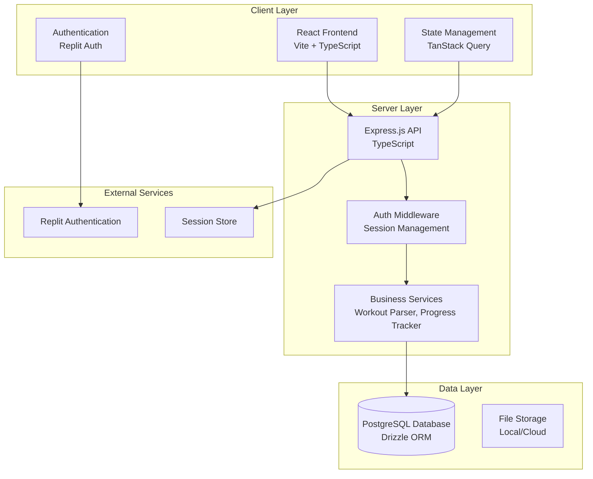
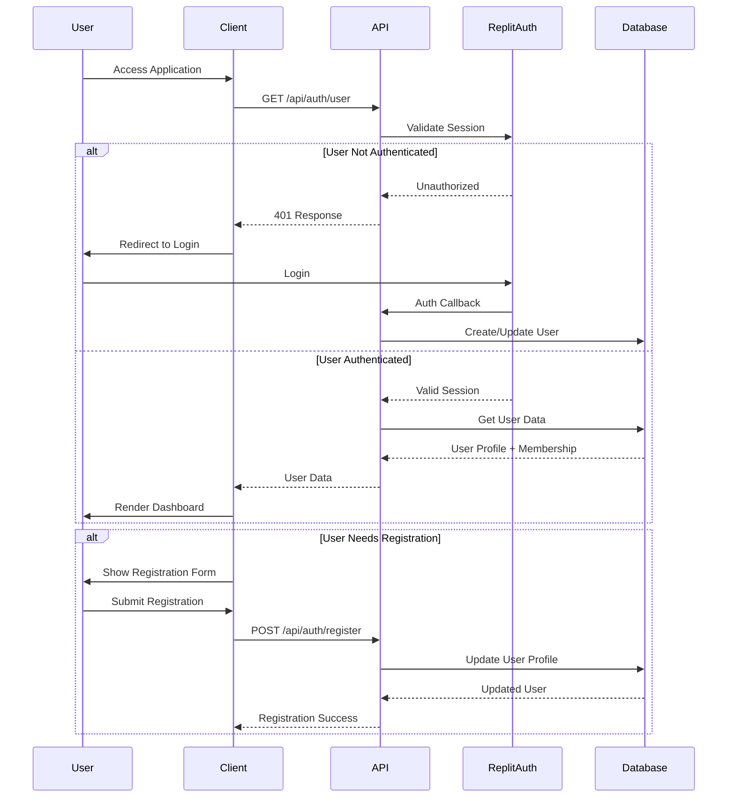
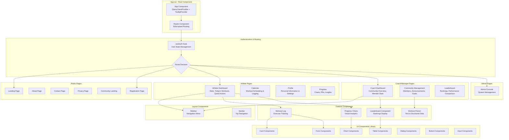
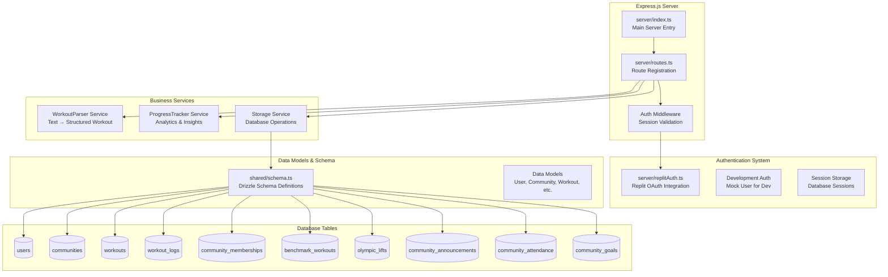
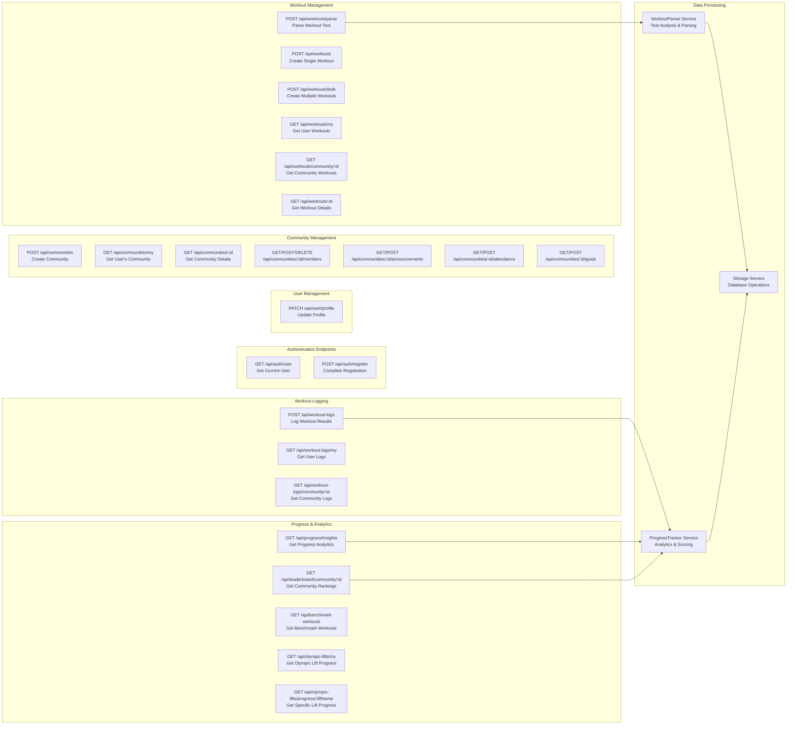
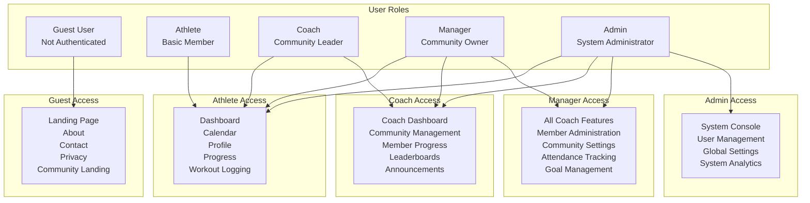
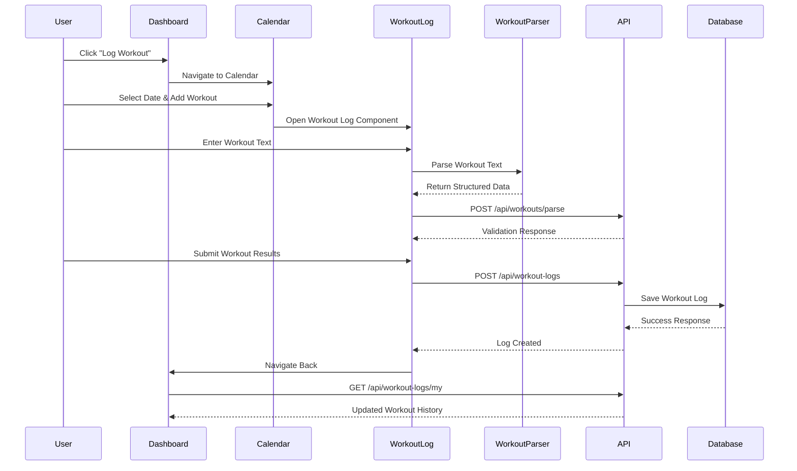
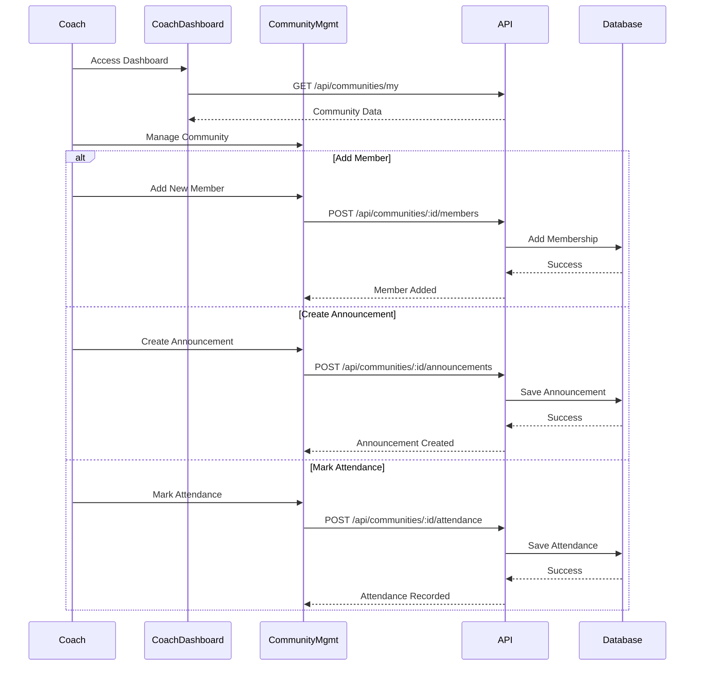
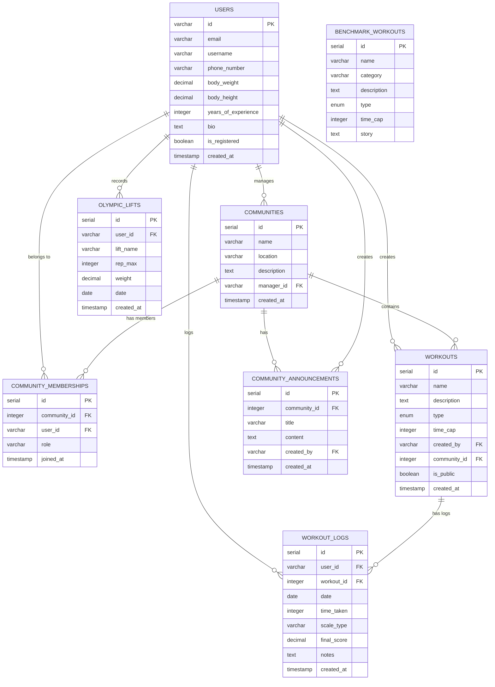

# AthletePro - Complete Component Diagram & Architecture

## 🏗️ System Architecture Overview

## 🔄 User Authentication Flow

## 📱 Frontend Component Architecture

## 🔧 Backend API Architecture

## 🔄 API Endpoints & Data Flow

## 👥 Role-Based Component Access

## 🔄 Component Interaction Flows

### Workout Logging Flow

### Community Management Flow

## 📊 Data Models & Relationships

## 🎯 Key Features & Components Summary

### **Frontend Components:**
- **40+ UI Components** (shadcn/ui library)
- **Role-based Pages** (Athlete, Coach, Admin dashboards)
- **Feature Components** (Workout logging, Progress tracking, Community management)
- **Layout Components** (Sidebar navigation, responsive design)

### **Backend Services:**
- **Authentication System** (Replit OAuth + Session management)
- **Workout Parser** (Text-to-structured workout conversion)
- **Progress Tracker** (Analytics, insights, scoring algorithms)
- **Storage Layer** (Database operations with Drizzle ORM)

### **Database Schema:**
- **11 Main Tables** with relationships
- **Role-based access control** (Athlete → Coach → Manager → Admin)
- **Comprehensive fitness tracking** (Workouts, logs, benchmarks, Olympic lifts)
- **Community features** (Memberships, announcements, attendance, goals)

### **Key Interactions:**
- **Authentication Flow** (OAuth → Registration → Role Assignment)
- **Workout Management** (Creation → Parsing → Logging → Analytics)
- **Community Management** (Members → Announcements → Attendance → Rankings)
- **Progress Tracking** (Personal Records → Insights → Leaderboards)

This architecture supports a scalable fitness tracking platform with role-based access, comprehensive workout management, and strong community features for CrossFit boxes and fitness communities.
